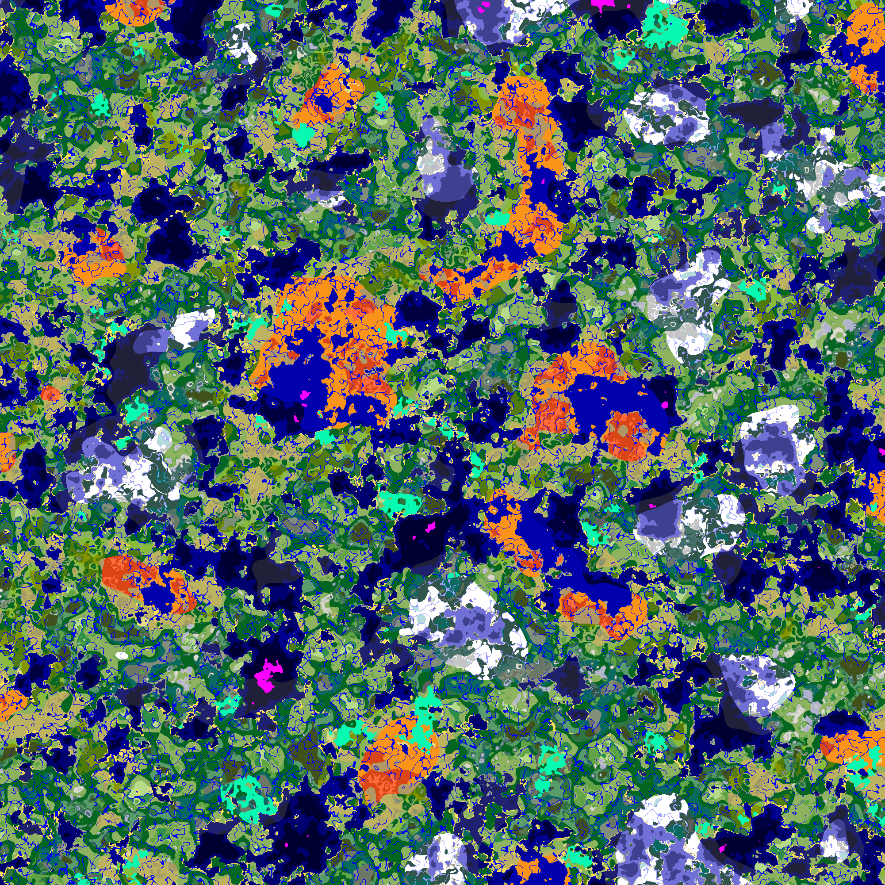

# Cubiomes.jl Docs

**Imitation of Minecraft's world generation in Julia.**

*Julia port of Cubiomes C library*

Cubiomes.jl provides a powerful and efficient implementation of Minecraft's world generation algorithms in the Julia programming language. Built as a port of the popular Cubiomes C library, this package offers superior performance while maintaining an elegant and approachable API.

## Audience

You should be familiar with programming. That's all. If you are not familiar with Julia, the syntax is quite easy (similar to Python in some ways). You can learn it by working with this package. Look at the [Examples](#examples) or [Getting Started](gettingstarted.md) pages to see how to use it.

There are already a lot of tools for Minecraft seed generation. Maybe Cubiomes.jl is not the best choice.
The goal of this package is to provide more than just a tool to generate Minecraft worlds, with a focus on performance. So it involves writing code, but an easy code thanks to Julia's high-level syntax. An example would be doing some statistics, or very specific seed searches.

## Quick Links

- [**Getting Started**](gettingstarted.md)
- [**Guide 📖**](guide.md)
- [**API Reference 📚**](api/main.md)

## New to Julia?

Read the [Getting Started](gettingstarted.md) page to learn how to install Julia and Cubiomes.jl and run your first program.

## Examples

Find a mushroom fields biome at a predefined location:

```@example language=julia
using Cubiomes

function search_biome_at(gen, x, z, y)
    seed = 0
    while true
        setseed!(gen, seed)
        if getbiome(gen, x, z, y) == Biomes.mushroom_fields
            println("Seed $seed has a Mushroom Fields at $((x, z, y))")
            break
        end
        seed += 1
    end
end

const gen = Overworld(undef, mcv"1.18")
search_biome_at(gen, 0, 0, 63)
```

Generate a map of biomes and save it as an image:

```julia
using Cubiomes
using FileIO

const overworld1_18 = Overworld(undef, mcv"1.18")
const worldmap = WorldMap(x=-1000:1000, z=-1000:1000, y=63)

setseed!(overworld1_18, 42)
genbiomes!(overworld1_18, worldmap, 📏"1:16")
save("world.png", to_color(view2d(worldmap)))
```


