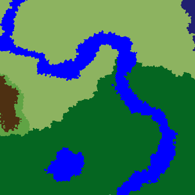
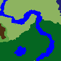

# Guide

This guide covers 90% of use cases.

## Table of contents {#Table-of-contents}
- [Minecraft version](/guide#Minecraft-versions)
  
- [Dimension object](/guide#Dimension-objects)
  
- [Biome generation](/guide#Biome-generation)
  
- [Biome generation on a world map](/guide#Biome-generation-on-a-world-map)
  

First of all, do not forget to import Cubiomes

```julia
using Cubiomes
```


## Minecraft versions {#Minecraft-versions}

To get a Minecraft version, simply use the `mcv` keyword (short for **M**ine**c**raft **v**ersion).

```julia
mcv"1.18"
```


```
mcv"1.18.2"
```


Note that the returned value is `mcv"1.18.2"`. This is because Cubiomes.jl focuses only on the latest minor version of Minecraft, meaning `mcv"1.18"` is _exactly_ the same as `mcv"1.18.2"`. Generally, everything remains the same between minor versions. But to be safe, ensure that the version matches the one you need.

Comparing versions is possible

```julia
mcv"beta1.7" < mcv"1.8"
```


```
true
```


However, the main purpose of versions is to link them to a dimension.

## Dimension objects {#Dimension-objects}

Before generating anything, we often need to get a specific dimension to work with. The three dimensions are:
- [`Overworld`](/api/BiomeGeneration#Cubiomes.BiomeGeneration.Overworld)
  
- [`Nether`](/api/BiomeGeneration#Cubiomes.BiomeGeneration.Nether)
  
- [`End`](/api/BiomeGeneration#Cubiomes.BiomeGeneration.End)
  

They are all subtypes of [`Dimension`](/api/BiomeGeneration#Cubiomes.BiomeGeneration.Dimension). To create a new dimension, link it to a version.

```julia
overworld = Overworld(undef, mcv"1.18")
```


```
Overworld Dimension (≥1.18, uninitialized)

```


As suggested by the `undef` keyword, the object is currently uninitialized and unusable. We need to assign it a seed.

```julia
set_seed!(overworld, 999)
```


Just retype `overworld` to see the initialized object. Not shown here because it is quite long.

The seed can be any valid Minecraft seed, i.e., a string or an integer. However, for performance reasons, integers are preferred.

The &quot;!&quot; at the end of [`set_seed!`](/api/BiomeGeneration#Cubiomes.BiomeGeneration.set_seed!-Tuple{Dimension,%20Any}) follows Julia’s convention, indicating that the function modifies the object (`overworld`) in place. This prevents the creation of a new object each time a seed is set, allowing reuse of the same `overworld` instance. The only thing that cannot be changed is the version. Think of it like the game starting with a specific version, and then you can load different worlds (seeds) in that version as long as you want.

## Biome generation {#Biome-generation}

We now have three key pieces of information combined in a single [`Dimension`](/api/BiomeGeneration#Cubiomes.BiomeGeneration.Dimension) object:
- the dimension
  
- the version
  
- the seed
  

Now, we just need to call the [`get_biome`](/api/BiomeGeneration#Cubiomes.BiomeGeneration.get_biome) function, providing our object and a coordinate.

```julia
get_biome(overworld, -55, 45, 63)
```


```
river::Biome = 0x07
```


The coordinates can be passed as three numbers or as a tuple (x, z, y):

```julia
coord = (-55, 45, 63)
get_biome(overworld, coord)
```


```
river::Biome = 0x07
```


::: warning Warning

In Cubiomes.jl, the coordinate order is **ALWAYS** `(x, z, y)`. This differs from Minecraft’s order, which is `(x, y, z)`.

:::

## Biome generation on a world map {#Biome-generation-on-a-world-map}

Let&#39;s generate an empty map with x and z ranging from -200 to 200, and `y = 63`.

```julia
worldmap = WorldMap(-200:200, -200:200, 63)
```


```
401×401×1 OffsetArray(::Array{Biome, 3}, -200:200, -200:200, 63:63) with eltype Biome with indices -200:200×-200:200×63:63:
[:, :, 63] =
 BIOME_NONE::Biome = 0xff  BIOME_NONE::Biome = 0xff  BIOME_NONE::Biome = 0xff  …  BIOME_NONE::Biome = 0xff  BIOME_NONE::Biome = 0xff  BIOME_NONE::Biome = 0xff
 BIOME_NONE::Biome = 0xff  BIOME_NONE::Biome = 0xff  BIOME_NONE::Biome = 0xff     BIOME_NONE::Biome = 0xff  BIOME_NONE::Biome = 0xff  BIOME_NONE::Biome = 0xff
 BIOME_NONE::Biome = 0xff  BIOME_NONE::Biome = 0xff  BIOME_NONE::Biome = 0xff     BIOME_NONE::Biome = 0xff  BIOME_NONE::Biome = 0xff  BIOME_NONE::Biome = 0xff
 BIOME_NONE::Biome = 0xff  BIOME_NONE::Biome = 0xff  BIOME_NONE::Biome = 0xff     BIOME_NONE::Biome = 0xff  BIOME_NONE::Biome = 0xff  BIOME_NONE::Biome = 0xff
 BIOME_NONE::Biome = 0xff  BIOME_NONE::Biome = 0xff  BIOME_NONE::Biome = 0xff     BIOME_NONE::Biome = 0xff  BIOME_NONE::Biome = 0xff  BIOME_NONE::Biome = 0xff
 BIOME_NONE::Biome = 0xff  BIOME_NONE::Biome = 0xff  BIOME_NONE::Biome = 0xff  …  BIOME_NONE::Biome = 0xff  BIOME_NONE::Biome = 0xff  BIOME_NONE::Biome = 0xff
 BIOME_NONE::Biome = 0xff  BIOME_NONE::Biome = 0xff  BIOME_NONE::Biome = 0xff     BIOME_NONE::Biome = 0xff  BIOME_NONE::Biome = 0xff  BIOME_NONE::Biome = 0xff
 BIOME_NONE::Biome = 0xff  BIOME_NONE::Biome = 0xff  BIOME_NONE::Biome = 0xff     BIOME_NONE::Biome = 0xff  BIOME_NONE::Biome = 0xff  BIOME_NONE::Biome = 0xff
 BIOME_NONE::Biome = 0xff  BIOME_NONE::Biome = 0xff  BIOME_NONE::Biome = 0xff     BIOME_NONE::Biome = 0xff  BIOME_NONE::Biome = 0xff  BIOME_NONE::Biome = 0xff
 BIOME_NONE::Biome = 0xff  BIOME_NONE::Biome = 0xff  BIOME_NONE::Biome = 0xff     BIOME_NONE::Biome = 0xff  BIOME_NONE::Biome = 0xff  BIOME_NONE::Biome = 0xff
 ⋮                                   ⋱                          ⋮
 BIOME_NONE::Biome = 0xff  BIOME_NONE::Biome = 0xff  BIOME_NONE::Biome = 0xff     BIOME_NONE::Biome = 0xff  BIOME_NONE::Biome = 0xff  BIOME_NONE::Biome = 0xff
 BIOME_NONE::Biome = 0xff  BIOME_NONE::Biome = 0xff  BIOME_NONE::Biome = 0xff     BIOME_NONE::Biome = 0xff  BIOME_NONE::Biome = 0xff  BIOME_NONE::Biome = 0xff
 BIOME_NONE::Biome = 0xff  BIOME_NONE::Biome = 0xff  BIOME_NONE::Biome = 0xff     BIOME_NONE::Biome = 0xff  BIOME_NONE::Biome = 0xff  BIOME_NONE::Biome = 0xff
 BIOME_NONE::Biome = 0xff  BIOME_NONE::Biome = 0xff  BIOME_NONE::Biome = 0xff  …  BIOME_NONE::Biome = 0xff  BIOME_NONE::Biome = 0xff  BIOME_NONE::Biome = 0xff
 BIOME_NONE::Biome = 0xff  BIOME_NONE::Biome = 0xff  BIOME_NONE::Biome = 0xff     BIOME_NONE::Biome = 0xff  BIOME_NONE::Biome = 0xff  BIOME_NONE::Biome = 0xff
 BIOME_NONE::Biome = 0xff  BIOME_NONE::Biome = 0xff  BIOME_NONE::Biome = 0xff     BIOME_NONE::Biome = 0xff  BIOME_NONE::Biome = 0xff  BIOME_NONE::Biome = 0xff
 BIOME_NONE::Biome = 0xff  BIOME_NONE::Biome = 0xff  BIOME_NONE::Biome = 0xff     BIOME_NONE::Biome = 0xff  BIOME_NONE::Biome = 0xff  BIOME_NONE::Biome = 0xff
 BIOME_NONE::Biome = 0xff  BIOME_NONE::Biome = 0xff  BIOME_NONE::Biome = 0xff     BIOME_NONE::Biome = 0xff  BIOME_NONE::Biome = 0xff  BIOME_NONE::Biome = 0xff
 BIOME_NONE::Biome = 0xff  BIOME_NONE::Biome = 0xff  BIOME_NONE::Biome = 0xff  …  BIOME_NONE::Biome = 0xff  BIOME_NONE::Biome = 0xff  BIOME_NONE::Biome = 0xff
```


Note that this is a 3D array, even if the size of `y` is 1. The `y` size can be greater than 1 as well. Some useful utility functions:
- [`coordinates`](/api/BiomeGeneration#Cubiomes.BiomeGeneration.BiomeArrays.coordinates-Tuple{AbstractArray{Biome}}): returns a collection of coordinates instead of biomes.
  
- [`view2d`](/api/BiomeGeneration#Cubiomes.BiomeGeneration.BiomeArrays.view2d-Tuple{AbstractArray{Biome,%203}}): provides a 2D view by removing the `y` axis when its size is 1. Useful for visualization so that Julia recognizes it as 2D. ⚠ This is a view, meaning modifying one also modifies the other. Use `copy` to create an independent map.
  
- [`to_color`](/api/Display#Cubiomes.Display.to_color-Tuple{Biome}): creates a new map with colors representing biomes (e.g., green for forests).
  

To visualize our map (completely empty at the moment):

```julia
to_color(view2d(worldmap))
```

{width=401px height=401px}

::: tip Note

If you see a bunch of numbers instead of an image, nothing is wrong. The colors are just not displayed in your environment. You can either:
- Use a Jupyter notebook
  
- Save the image using `FileIO` and `ImageIO`: `using FileIO; save("worldmap.png", to_color(worldmap))`
  

:::

The map is currently empty. To populate it with biomes from our `overworld` object, we would think about simply iterating over all coordinates and assigning the biome to each.

```julia
function populate_map!(overworld, worldmap)
    for coord in coordinates(worldmap)
        worldmap[coord] = get_biome(overworld, coord)
    end
end
populate_map!(overworld, worldmap)
to_color(view2d(worldmap))
```

{width=401px height=401px}

And it works! However, it could be inefficient. Because of how Minecraft generation works, we can optimize the process using algorithms that take advantage of a global world view. For certain dimensions/versions, this can be significantly faster. That&#39;s what [`gen_biomes!`](/api/BiomeGeneration#Cubiomes.BiomeGeneration.gen_biomes!-Tuple{Dimension,%20AbstractArray{Biome}}) is for.

```julia
gen_biomes!(overworld, worldmap)
to_color(view2d(worldmap))
```

{width=401px height=401px}

Let&#39;s see the performance difference:

```julia
@time populate_map!(overworld, worldmap)
```


```
  0.642230 seconds
```


```julia
@time gen_biomes!(overworld, worldmap)
```


```
  0.300326 seconds (41 allocations: 4.781 KiB)
```


A world map acts like a standard array; the only difference is that its indices correspond to Minecraft coordinates.

```julia
worldmap[-55, 45]
```


```
river::Biome = 0x07
```


```julia
worldmap[-255, 45]
```


```
BoundsError: attempt to access 401×401×1 OffsetArray(::Array{Biome, 3}, -200:200, -200:200, 63:63) with eltype Biome with indices -200:200×-200:200×63:63 at index [-255, 45]
```


## The scale object {#The-scale-object}

In `get_biome` and `gen_biomes!`, there is an optional final argument: the `Scale` object. A scale can be created using 📏&quot;1:N&quot;, where N is a power of 4.

```julia
worldmap2 = WorldMap(-50:50, -50:50, 16)
gen_biomes!(overworld, worldmap2, 📏"1:4")
to_color(view2d(worldmap2))
```

{width=101px height=101px}

The scale determines the size of square/cube regions where only one block from each region is &quot;sampled&quot; and displayed as one pixel. A larger scale results in a more zoomed-out map.

::: warning Warning

When using a scale, **the indices no longer match Minecraft coordinates**. Instead, for example, with scale 📏&quot;1:4&quot;, they correspond to chunk coordinates.

:::

The first scales are:
- `📏"1:1"` — Block scale
  
- `📏"1:4"` — Chunk scale
  
- `📏"1:16"`, `📏"1:64"`, `📏"1:256"`, `📏"1:1024"`, ..., `📏"1:4^k"` for any integer `k`
  

In some versions and dimensions, this approach is much faster than simply dividing the coordinates by the scale, since Minecraft&#39;s biome generation algorithm inherently divides the world into regions multiple times until reaching scale `📏"1:1"`.

```
4
```


---


_This page was generated using [Literate.jl](https://github.com/fredrikekre/Literate.jl)._
